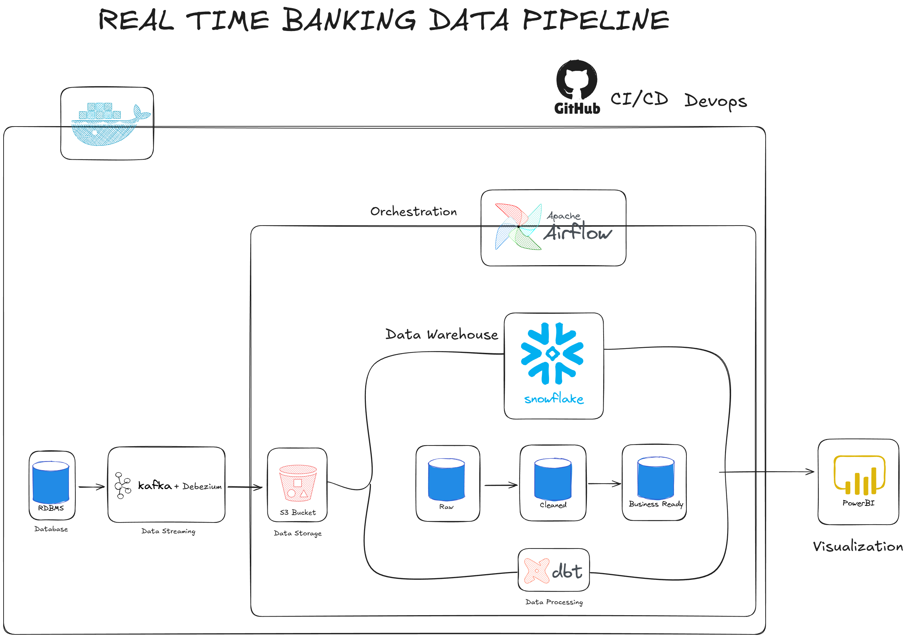

# 🏦 Banking Modern Data Stack (Real-Time Pipeline)

## 📌 Project Overview
An end-to-end modern data stack project for a **banking domain**. Synthetic **customers, accounts, and transactions** are generated, captured via **CDC**, landed in object storage, loaded into **Snowflake**, transformed with **dbt (SCD2 + marts)**, orchestrated with **Airflow**, and visualized in **Power BI** — with **CI/CD** in GitHub Actions.

---

## Architecture (Pipeline Flow)

**Faker (Postgres)** → **Debezium + Kafka (CDC)** → **MinIO (Parquet landing)** → **Airflow (orchestration)** → **Snowflake (RAW → ANALYTICS)** → **dbt (staging + snapshots + marts)** → **Power BI (dashboard)**

---

## Tech Stack
- **PostgreSQL** (OLTP source)
- **Kafka + Debezium** (Real-time streaming & CDC)
- **MinIO** (S3-compatible object storage)
- **Apache Airflow** (orchestration)
- **Snowflake** (data warehouse)
- **dbt** (transformations, testing, snapshots / SCD Type-2)
- **Python** (Faker generator, Kafka consumer, connector setup)
- **Docker / docker-compose** (local infra)
- **GitHub Actions** (CI/CD)
- **Power BI** (visualization)

---

## Key Features
- Real-time CDC from Postgres (WAL) using Debezium + Kafka  
- Parquet landing zone in MinIO (raw ingestion)  
- Airflow DAGs for **MinIO → Snowflake** loads + dbt snapshot orchestration  
- dbt **staging models**, **SCD2 snapshots**, and **fact/dimension marts**  
- GitHub Actions **CI** (lint + dbt compile) and **CD** (dbt run + test)  
- Power BI semantic model + dashboard KPIs

---

## Repository Structure
```
banking-modern-datastack/
├── .github/workflows/              # CI/CD pipelines
├── banking_dbt/                    # dbt project (staging, snapshots, marts)
│   ├── models/
│   ├── snapshots/
│   └── dbt_project.yml
├── consumer/                       # Kafka → MinIO writer
├── data-generator/                 # Faker → Postgres
├── docker/dags/                    # Airflow DAGs
├── kafka-debezium/                 # Debezium connector setup
├── postgres/                       # Postgres schema (DDL)
├── docker-compose.yml
├── dockerfile-airflow.dockerfile
├── requirements.txt
└── README.md
```

---

## Step-by-Step Implementation
1) **Generate OLTP data (Postgres):** Create `customers`, `accounts`, `transactions` tables and continuously insert synthetic records via a Faker-based Python generator.  
2) **Capture changes (CDC):** Use **Debezium + Kafka Connect** to read Postgres WAL (logical replication) and publish change events to Kafka topics.  
3) **Land raw data (MinIO):** A Kafka consumer batches events and writes Parquet files into **MinIO** (S3-style raw landing bucket).  
4) **Orchestrate loads (Airflow):** Airflow DAGs pull Parquet from MinIO and load into **Snowflake RAW** tables on a schedule.  
5) **Transform + history (dbt):** dbt builds staging views, runs **SCD2 snapshots**, and creates analytics-ready **fact/dimension marts** in `BANKING.ANALYTICS`.  
6) **Visualize (Power BI):** Connect to Snowflake, model dims/fact relationships, and build KPI dashboards.


---

## Final Deliverables
- Automated CDC pipeline from Postgres → Kafka/Debezium → MinIO → Snowflake  
- dbt transformations: staging models, SCD2 snapshots, and fact/dimension marts  
- Orchestrated Airflow DAGs for ingestion + dbt snapshot/model runs  
- Synthetic banking dataset (customers, accounts, transactions) for demos  
- CI/CD workflows (GitHub Actions) to validate and deploy dbt reliably